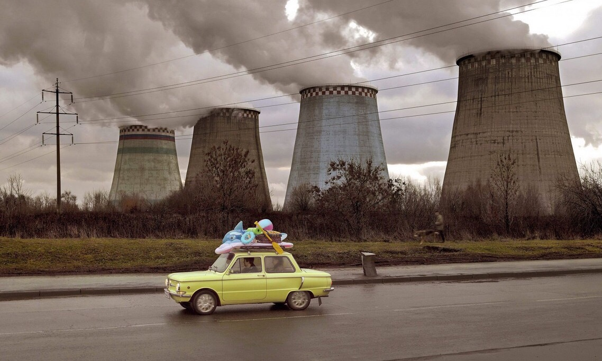

# Лаб1
## Задание
1. Реализовать программу согласно варианту задания. Базовый алгоритм,
используемый в программе, необходимо реализовать в 3 вариантах: с
использованием встроенных функций какой-либо библиотеки (OpenCV,
PIL и др.) и нативно на Python + |с использованием Numba или C++|.
2. Сравнить быстродействие реализованных вариантов.

Вариант 6
Нормирование MINMAX. На вход поступает изображение, программа
отрисовывает окно, в которое выводится либо исходное изображение
после преобразования в черно-белое, либо после нормирования
(переключение по нажатию клавиши). Базовый алгоритм -
нормирование.

## Теоретическая база
Нормирование — это преобразование данных к безразмерным единицам.
Для нормирования MinMax исходный набор пикселей преобразовывается в диапазон [0..1] по формуле:
 

## Описание разработанной системы

Переключение реузльтатов программы осуществляется с помощью клавиатуры, где
1 - исходное цветное изображение
2 - черно-белое изображение 
3 - нормированное с помощью OpenCV изображение
4 - нормированное нативно на Python изображение
5 - нормированное нативно на Python с использованием Numba изображение
6 - завершение программы

В варианте с OpenCV была использована функция normalize:
cv2.normalize(img, None, 0, 1.0, cv2.NORM_MINMAX, dtype=cv2.CV_32F)

1.	Принимает входное изображение img.
2.	Параметр None означает, что используется общее масштабирование по всем каналам изображения.
3.	Значения 0 и 1.0 указывают на диапазон значений пикселей, в котором нужно выполнить нормализацию.
4.	Параметр cv2.NORM_MINMAX указывает, что для нормализации необходимо использовать минимальное и максимальное значения пикселей изображения.
5.	Параметр dtype=cv2.CV_32F указывает на тип данных, используемый для хранения пикселей в нормализованном изображении. В данном случае используется 32-битное число с плавающей точкой.

## Результаты работы и тестирования системы

Исходное изображение  
   
Изображение после нормирования 
   

Была произведена оценка быстродействия реализованных вариантов

| Вариант                    | Время обработки |
|----------------------------|-----------------|
| С  помощью OpenCV          | 0.014 с         |  
| Нативно на Python          | 0.024 с         | 
| С  помощью Numba           | 0.019 с         | 

## Выводы по работе
В результате работы было выяснено, что наиболее быстрым вариантом нормирования является использование библиотеки OpenCV. Написание кода нативно на Python дает наихудший результат, однако это время можно улучшить с помощью Numba.

## Использованные источники
[1] https://www.codecademy.com/article/normalization  
[2] https://www.tutorialspoint.com/how-to-normalize-an-image-in-opencv-python  

