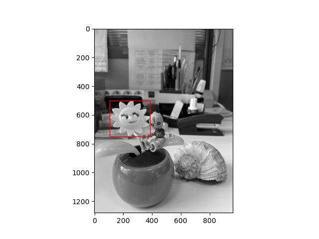

# ЛР2
## Цель работы
Исследовать простейшие алгоритмы детектирования объектов на изображении.

## Теоретическая база

### 1. Прямой поиск одного изображения на другом (template matching)
*Template matching* — метод, основанный на нахождении места на изображении,
наиболее похожем на шаблон. “Похожесть” изображения задается определенной 
метрикой. То есть, шаблон "накладывается" на изображение, и считается
расхождение между изображением и шаблоном. Положение шаблона, 
при котором это расхождение будет минимальным, и будет означать 
место искомого объекта.

### 2. Поиск ключевых точек эталона на входном изображении с помощью ORB
ORB представляет собой сочетание детектора ключевых точек FAST и дескриптора BRIEF со многими модификациями для 
повышения производительности.
*Особая (ключевая) точка изображения* – это точка изображения, окрестность которой можно отличить от окрестности любой другой точки 
изображения в некоторой другой окрестности особой точки. В качестве окрестности точки изображения для большинства 
алгоритмов берётся прямоугольное окно, составляющее размер 5x5 пикселей. Процесс определения особых точек достигается 
путём использования детектора и дескриптора.  

После того, как особые точки найдены, вычисляют их дескрипторы, т.е. наборы признаков, характеризующие окрестность 
каждой особой точки.  
*FAST* - метод поиска особых точек, который завоевал большую популярность из-за своей вычислительной эффективности. 
Для принятия решения о том, считать заданную точку **С** особой или нет, в этом методе рассматривается яркость пикселей
на окружности с центром в точке **С** и радиусом 3
*BRIEF* – быстрый эвристический дескриптор, строится из 256 бинарных сравнений между яркостями пикселов на размытом изображении.  

В ORB Предложено сначала вычислять ориентацию особой точки и затем проводить бинарные сравнения уже в соответствие с этой ориентацией. 

## Описание разработанной системы

Напишем алгоритм, который определит, есть ли изображение (шаблон) на оригинальной фотографии.  
Подход будет заключаться в просмотре всех возможных **h x w** окон, которые соответствуют размеру шаблона, и попиксельной проверке. 
Для этого надо найти интегральное изображение с помощью numpy и вычислить сумму внутри **h x w** шаблона, начиная с каждого пикселя.
```
sat = im.cumsum(1).cumsum(0)
tplsum = np.array([tpl[:, :, i].sum() for i in range(D)])
```

Далее вычислим сумму **h x w** окон оригинального изображения и сравним ее с ранее найденной суммой, чтобы получить список "возможных окон".

```
iA, iB, iC, iD = sat[:-h, :-w], sat[:-h, w:], sat[h:, :-w], sat[h:, w:]
lookup = iD - iB - iC + iA
possible_match = np.where(np.logical_and.reduce([lookup[..., i] == tplsum[i] for i in range(D)]))
```

Для получения окончательного результата проводим попиксельное сравнение
```
for y, x in zip(*possible_match):
   if np.all(im[y+1:y+h+1, x+1:x+w+1] == tpl):
      return (y+1, x+1)
```

Работа алгоритма ORB:  

1) Особые точки обнаруживаются при помощи быстрого древовидного FAST на исходном изображении и на нескольких изображениях из пирамиды уменьшенных изображений.  

2) Для обнаруженных точек вычисляется мера Харриса, кандидаты с низким значением меры Харриса отбрасываются.  

3) Вычисляется угол ориентации особой точки. Для этого, сначала вычисляются моменты яркости для окрестности особой точки.
   Всё это авторы назвали «центроид ориентации». В итоге получаем некоторое направление для окрестности особой точки.  

4) Имея угол ориентации особой точки, последовательность точек для бинарных сравнений в дескрипторе BRIEF поворачивается в соответствие с этим углом.  
5) По полученным точкам вычисляется бинарный дескриптор BRIEF.

## Результаты работы

| Шаблон       | Template matching | ORB |
| ------------- |:------------------:| -----:|      
|| | |
|| | |
|| |  |
|| |  |
|| |  |
|| |Шаблон не найден|
|| | |
||Шаблон не найден||
| |Шаблон не найден||
| |Шаблон не найден||

## Вывод

Template matching справляется со своей задачей, если шаблон является частью искомого изображения, так как этот алгоритм требует попиксельного соответствия. В 7 случаях он точно определил местоположение рамки, тогда как в 3 не смог найти нужного шаблона.

ORB точно детектировал объект в 2 из 10 случаях, еще в 2 случаях он правильно определил объект, но проставил рамку меньшего размера. В 5 экспериментах рамка была поставлена рамка большего размера, в некоторых случаях не полностью захватывая обхект. 1 раз ORB не смог найти объект из-за его небольшого размера.


## Список использованной литературы
- https://habr.com/ru/company/joom/blog/445354/
- https://habr.com/ru/post/414459/
- https://habr.com/ru/post/244541/
- https://vc.ru/dev/249864-poisk-izobrazheniy-po-fragmentu-s-pomoshchyu-orb
