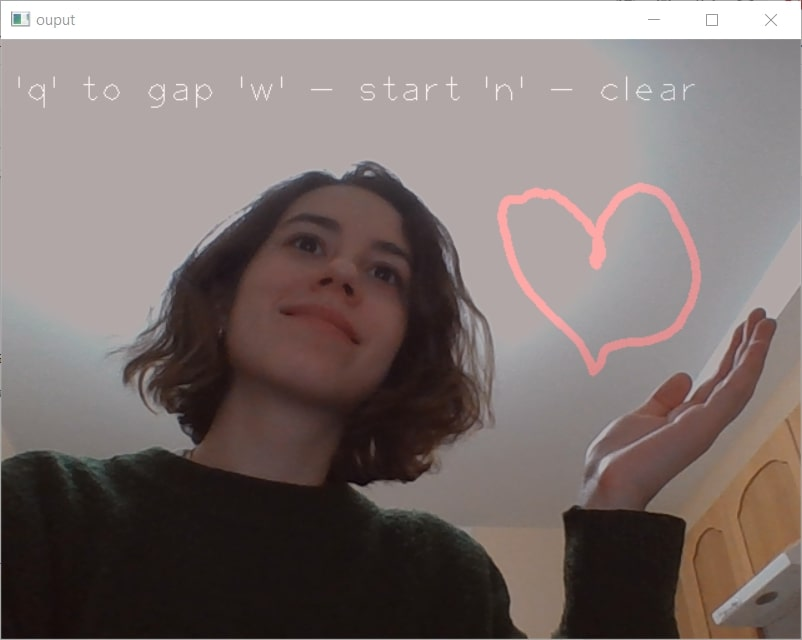
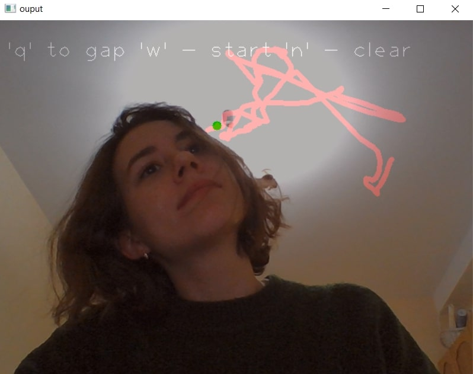

# Лаб4

## Тема проекта

Разработка программы для рисования в воздухе на видео в режиме реального времени.

## Описание разработанной системы

Принцип работы алгоритма заключается в использовании оптического потока. 

Оптический поток — это изображение видимого движения объектов, поверхностей или краев сцены, получаемое в результате перемещения наблюдателя (глаз или камеры) относительно сцены. 
Методы, основанные на оптическом потоке, вычисляют движение между двумя кадрами, взятыми в момент времени и в каждом пикселе. Эти методы называются дифференциальными, так как они основаны на приближении сигнала отрезкомряда Тейлора; таким образом, они используют частные производные по времени и пространственным координатам.
Задача вычисления оптического потока нацелена на восстановление изображения (или векторного поля), которое бы показывало для входной пары изображений куда какой пиксель между ними перемещается. В итоге мы для каждого пикселя ищем вектор, который показывал бы направление перемещения пикселей между первым и вторым изображением.

Программа работает следующим образом:

1. С помощью нажатия на левую кнопку мыши происходит фиксация объекта, которым будет производиться рисование.

2. Если нажата клавиша 'q', рисование линии останавливается и можно его возобновить из другой точки.

3. Если нажата клавиша 'w', рисование линии продолжается.

4. Если нажата клавиша 'n', происходит стирание всего рисунка.

5. Если нажата клавиша 'Esc', окно закрывается.

## Результаты работы и тестирования системы.

Результат работы программы представлен на рисунке
  
   
 

## Недостатки алгоритма

1. Существует задержка, поэтому писать в быстром темпе не получится.
2. Необходим ровный однотонный фон, чтобы курсор за него не зацепился 
3. При пересечении в кадре с человеком курсор так же может на него перепрыгнуть

Например, здесь курсор переместился на волосы и регистировались движения не пальца, а головы. 
 
  

## Выводы

В результате работы была получена система рисования в воздухе на видео в режиме реального времени. 

